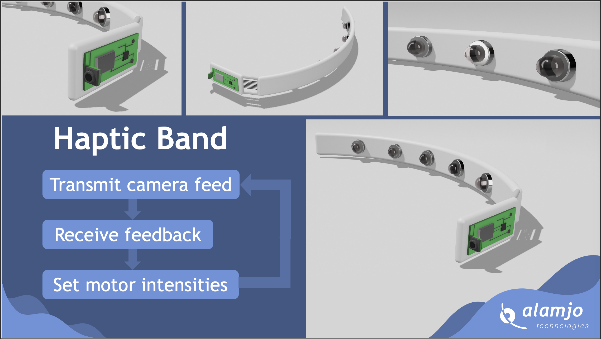

# Avery1.0
Wearable Haptic device for sensory augmentation, providing real-time environmental feedback for increased spatial awarness
# Avery 1.0 — Haptic Feedback Band for Spatial Awareness

Avery is a wearable haptic feedback device developed to enhance spatial awareness through real-time environmental sensing. Designed primarily for sensory augmentation, this device provides vibrational feedback based on obstacle proximity detected via a camera, aiding users (especially the visually impaired) in perceiving their surroundings through touch.

## 🔧 How It Works

The system is composed of two primary components:

### 1. **ESP32-CAM Unit**
- Mounted on the back of the head.
- Continuously captures images of the environment.
- Sends visual data wirelessly to a server for processing.

### 2. **Local Server (Python-based)**
- Receives images from the ESP32-CAM.
- Uses a depth estimation model to process the input and determine obstacle distance.
- Outputs a vector of motor intensities, which is sent back to the microcontroller to drive vibration motors accordingly.

## 🧠 Key Features
- **Real-Time Depth Estimation**
- **Wireless Communication (ESP32 ↔ Server)**
- **Multi-Motor Haptic Feedback Mapping**
- **Compact and Wearable 3D-Printed Design**

## 📸 Product Images

### Prototype Renders

### Real-World Assembly

### Server-Side Interface

## 🖥️ Code Overview

### `/main.cpp`
Handles:
- Camera initialization (ESP32-CAM)
- WiFi setup
- Sending captured image frames to the server
- Receiving processed motor feedback values
- Driving vibration motors using PWM based on server input

### `/server.py`
Performs:
- HTTP server functionality to receive images
- Calls a depth estimation model (can be extended with PyTorch or ONNX)
- Maps depth data into vibration levels
- Sends motor commands back to ESP32

---

## 🚀 Getting Started

1. Flash the ESP32-CAM with `main.cpp`.
2. Run `server.py` on your local machine.
3. Connect both devices to the same WiFi network.
4. Wear the band and begin moving around — feel the environment through vibration.

---

## 📂 Folder Structure
