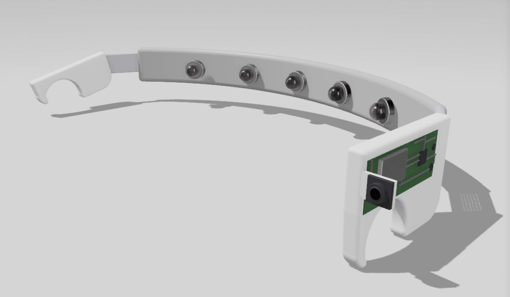
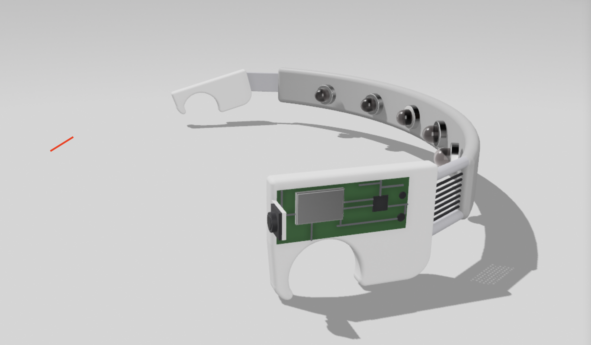
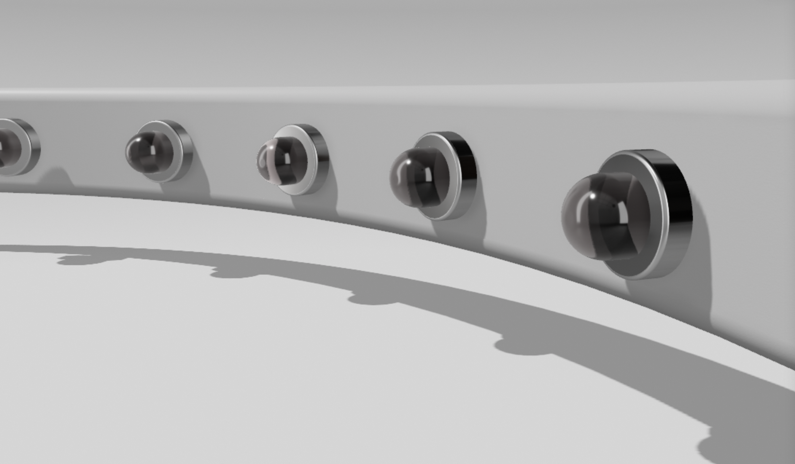
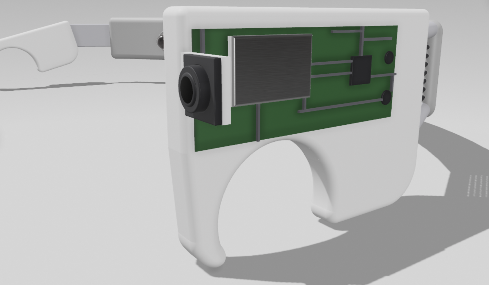
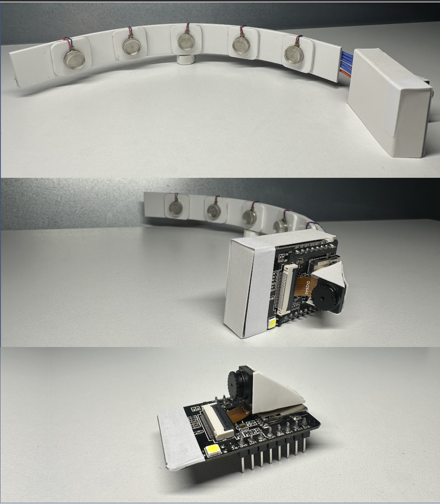
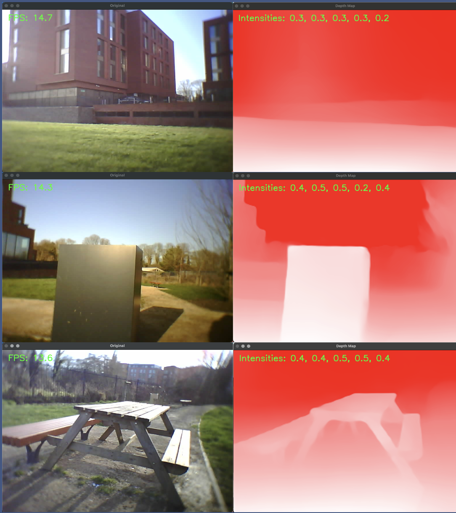

# Avery 1.0 — Haptic Feedback Band for Spatial Awareness

Avery is a wearable haptic feedback device developed to enhance spatial awareness through real-time environmental sensing. Designed primarily for sensory augmentation, this device provides vibrational feedback based on obstacle proximity detected via a camera, aiding users (especially the visually impaired) in perceiving their surroundings.

## How It Works

The system is composed of two primary components:

### 1. **ESP32-CAM Unit**
- Mounted on the side of the head capturing the front view of the user.
- Continuously captures images of the environment.
- Sends visual data wirelessly to a server for processing.

### 2. **Server (Python-based)**
- Receives images from the ESP32-CAM.
- Uses a depth estimation model to process the input and determine obstacle distance.
- Outputs a vector of motor intensities, which is sent back to the microcontroller to drive vibration motors accordingly.

## Key Features
- **Real-Time Depth Estimation**
- **Wireless Communication (ESP32 ↔ Server) using the esp-32 as an access point**
- **Multi-Motor Haptic Feedback Mapping**
- **Compact and Wearable Design**

## Product Images

  
   
  
  

  ### Real-World Assembly
   
  ### Server-Side Interface
  

## 🖥️ Code Overview

### `/main.cpp`
Handles:
- Camera initialization (ESP32-CAM)
- WiFi setup
- Sending captured image frames to the server
- Receiving processed motor feedback values
- Driving vibration motors using PWM based on server input

### `/server.py`
Performs:
- HTTP server functionality to receive images
- Calls a depth estimation model (can be extended with PyTorch or ONNX)
- Maps depth data into vibration levels
- Sends motor commands back to ESP32

---

## 🚀 Getting Started

1. Flash the ESP32-CAM with `main.cpp`.
2. Run `server.py` on your local machine.
3. Connect both devices to the same WiFi network.
4. Wear the band and begin moving around — feel the environment through vibration.

---

## 🧠 Future Work

- Integrate lightweight depth estimation models (e.g., FastDepth) for onboard processing.
- Optimize latency and energy consumption.
- Add support for edge-case detection (stairs, drop-offs).
- Improve haptic feedback resolution and user configurability.

---

## 🙏 Credits

Developed by [Meskh](https://github.com/meskh)   
Part of a personal sensory augmentation initiative.

---
